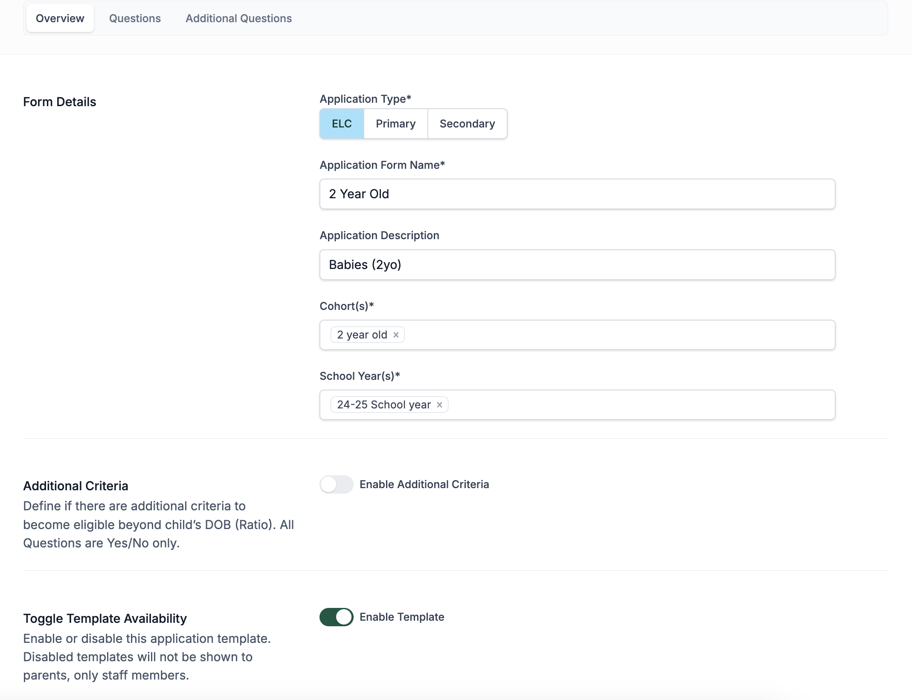
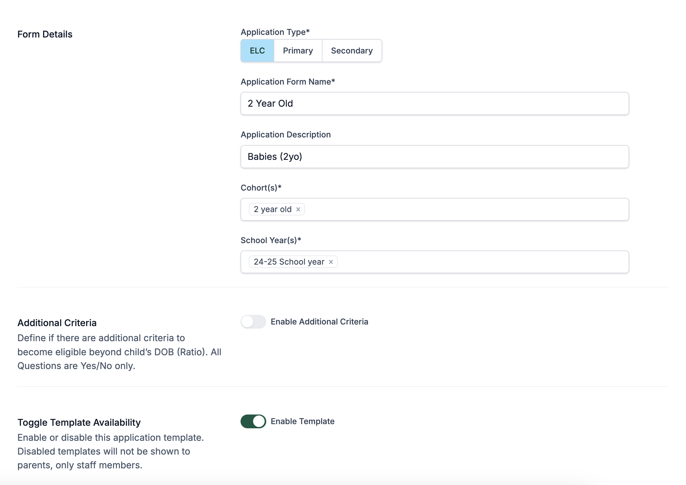
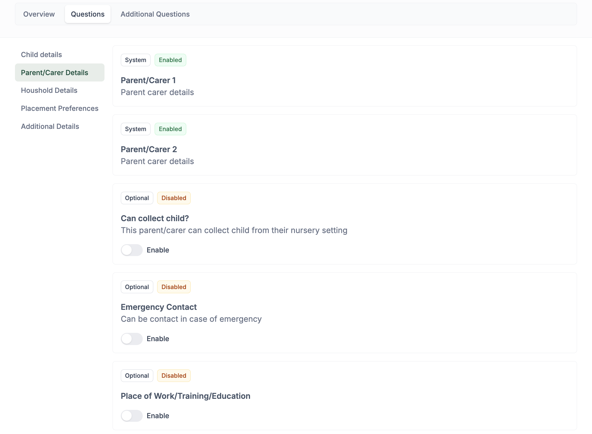
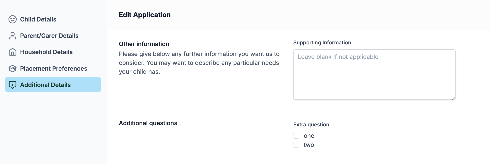
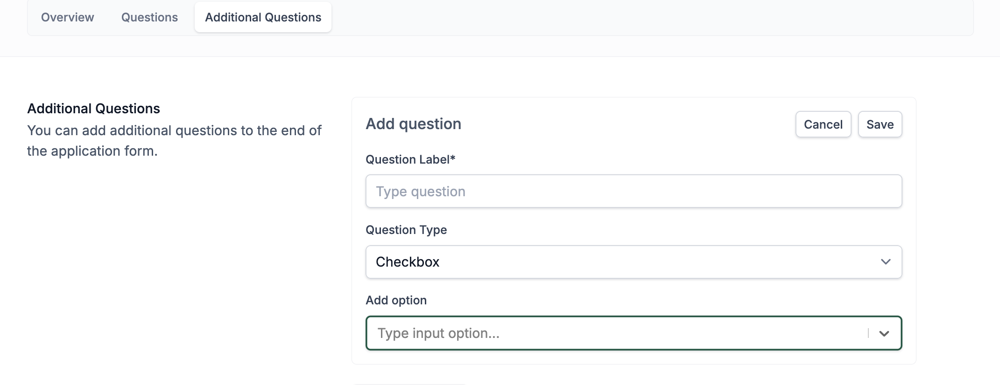

# Application Forms

This guide outlines the steps for creating a new application form and customising its questions.

## Creating a New Application Form

To begin creating a new application form:

1. Navigate to **Settings** > **Application Forms** in the left-hand menu.
2. Click on the **"Add Form"** button (top right).
3. In the **New Application Template** screen, fill out the following fields:

   - **Application Type**: Choose from `ELC`, `Primary`, or `Secondary`.
   - **Application Form Name**: Provide a title for the form.
   - **Application Description**: Optional description (can be the same as the name).
   - **Cohort(s)**: Select applicable cohort(s) (e.g., Secondary).
   - **School Year(s)**: Select the relevant school year(s) (e.g., `PS 24-25 School Year`). This field defines what application form is visible for the defined school year.

4. Click **Create** to proceed.

---

## Editing the Form Settings

Application Form consists of three sections that you can navigate between using the tabs at the top of the page.

### Overview Tab

Once the form is created you’ll be taken to the **Edit Form** screen. Here, you can:
   - Update the **form name**, **description**, **cohorts**, or **school years**.
   - **Toggle template availability**:
     - Enable: Makes the form visible to parents.
     - Disable: Keeps it hidden from parents (for internal use/testing).
   - Optionally enable **Additional Criteria**, which adds simple Yes/No checks based on eligibility rules like Date of Birth.

Click **Update** to save changes.

### Questions

Navigate to the **Questions** tab to view and configure standard questions included in the form template:

- The system displays grouped sections such as:
  - **Child details**
  - **Parent/Carer Details**
  - **Household Details**
  - **Placement Preferences**
  - **Additional Details**

You can:
- See which questions are **System Enabled** (required).
- Toggle **Optional** questions on or off:
  - e.g., `Can collect child?`, `Emergency Contact`, `Place of Work/Training/Education`.

---

### Adding Custom Questions

In **Additional Questions**, you can create tailored queries to suit your local context. Questions will be added to the bottom of the Additional Details section of the application form.

1. Enter a **Question Label** (e.g., “Does the child require transport?”).
2. Select a **Question Type**:
   - Select between: Checkbox (multiple choices), Radio (single choice), Paragraph (text area for longer answer), Text input (for typing short answer).
3. Click **Save** to add it to the form.

Repeat for multiple custom questions as needed.

