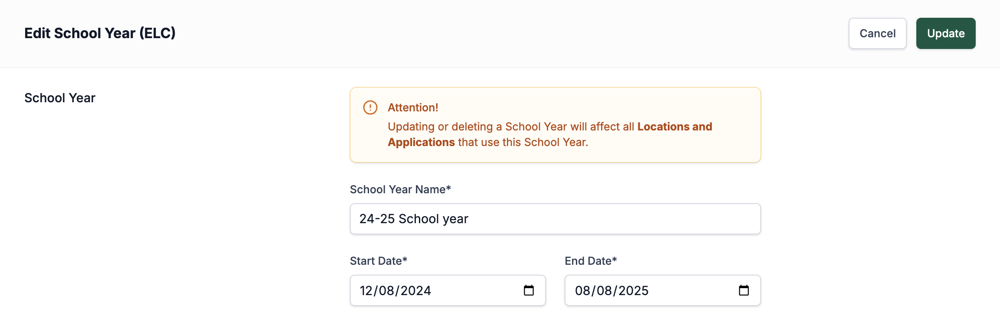
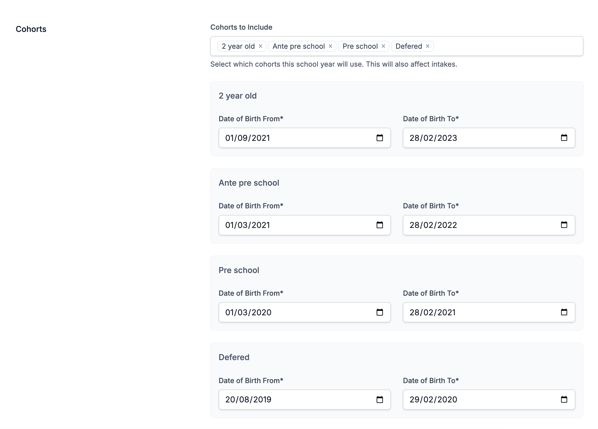
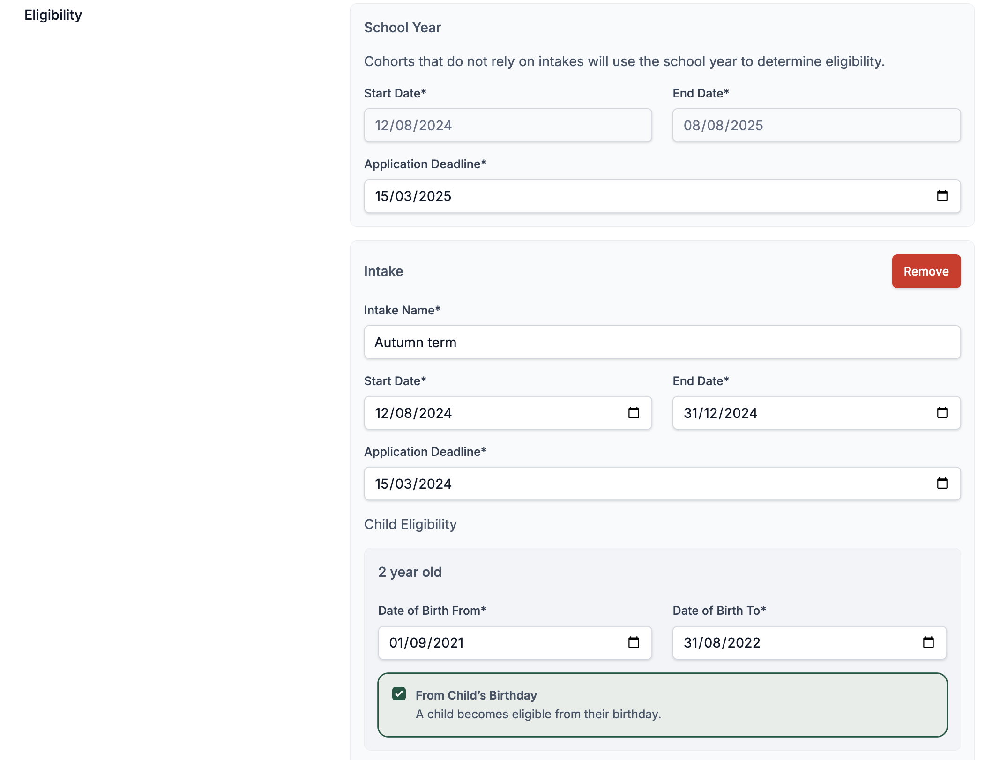
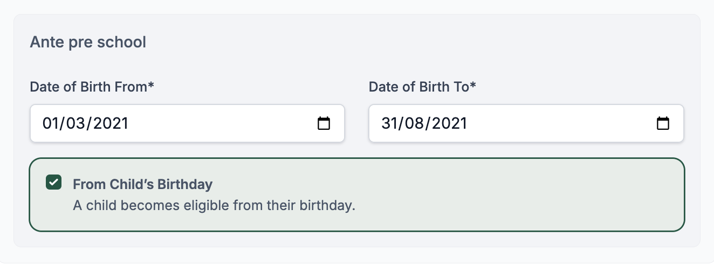

# School Year Setup

The School Year Setup section guides you through configuring the academic structure for both Early Learning and Childcare (ELC) and Primary/Secondary schools. Setting up school years accurately is essential to manage eligibility, cohorts, and intakes throughout the year. In this guide, you’ll learn how to create school years, assign cohorts, and define eligibility criteria to ensure that applications, placements, and intakes align properly with each child’s stage of education.

## School Year

When setting up a school year, you need to give it a name and set the start and end dates. These dates will be what’s set later on the page in the eligibility section.

School years are set up separately for ELC and for primary/secondary schools. ELC school years should be set up under **School Years (ELC)**, while primary and secondary school years should be set up under **School Years (P/S)**.

## Cohorts

Next, you need to set which cohorts are in the school year and the date of birth ranges for them (they can overlap, but when setting up there shouldn't be gaps with missing dates). For an ELC school year, these will normally be 2-year-old, Ante Pre-school, Pre-school, and Deferred cohorts. For a Primary and Secondary school year, it will have Primary and Secondary cohorts.

## Eligibility

This section is where you can set the intakes, deadlines for these intakes, and how cohorts relate to intakes. Inside the Cohorts page in Settings, you can configure whether cohorts use intakes or are just set to the start of the school year. Every cohort that is set to use intakes appears under every intake in this section, apart from the default one.

If you are setting up a Primary or Secondary school year, you don’t need to add any intakes. However, for an ELC school year, you will usually be adding a few. To create the first and subsequent intakes, press the **Add Intake** button. A section will then appear with empty date fields and the cohorts that use intakes, along with their date ranges. 

The date ranges at the top are for setting how long the intake lasts—i.e., what part of the school year date range it covers—and a deadline for applications to be submitted by parents. Applications submitted after the deadline are still allowed but will be marked in reports as submitted after the deadline.

The date fields in the cohorts show the range of children's birthdays that are eligible for this intake within specific cohorts. There is also a checkbox: if checked, it allows children whose birthdays fall after the start date of the intake to join and reserve a space in that intake. However, they will not start until after their birthday.

