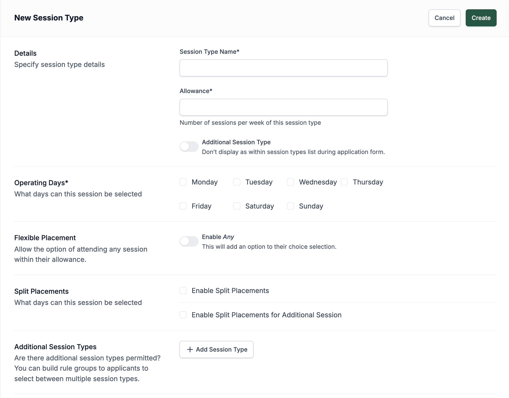

# Session Types

The Session Types section explains how to define the different session options available to children attending Early Learning and Childcare (ELC) settings. Session types help manage how children are allocated across available days and locations, taking into account flexible placements and additional sessions where needed. In the following guide, you’ll learn how to create, edit, and manage session types, ensuring the system accurately reflects the session offerings at your nurseries and supports both structured and flexible childcare needs.

## Creating Session Types

Session types are only used for ELC and represent the actual sessions that the children will be attending. When you first view the page, it shows a list of all the session types already set. To create a session type, simply press the **Add Session Type** button and you will be taken to a new page to create the session.

First, set the name and how many sessions are available per week. This is not how many days this session runs, but how many sessions the child is eligible for per week—this number does not include additional sessions. There is also a toggle to set the session type being created as an additional session. These sessions are not main sessions but secondary sessions that can be added to main sessions.

After this section, there are checkboxes to set the operating days of this session type. Below that, you have the option to allow **Any** choices. Any choices are selections parents can make when they don’t mind which days their child attends. Instead of selecting specific days, the system will allocate days to fit as many children in as possible. Enabling this option doesn’t force all parents to select **Any**; it simply leaves it available as an option. Parents can still choose specific days if they prefer.

:::danger[Enabling Any]
This action is irreversible. Once flexible placement for the session type is added, it can not be removed.
:::

The next section allows you to enable split sessions (blended placement). These sessions are divided between locations using the same session type and can also be configured to allow additional sessions to be split between different locations.

## Updating/Deleting Session Types

Once session has been created you can select it from the list and click on pencil icon to edit. Updating or deleting a session type will affect all sessions that use this session type.

You can not delete session type if there are locations using this session type.

