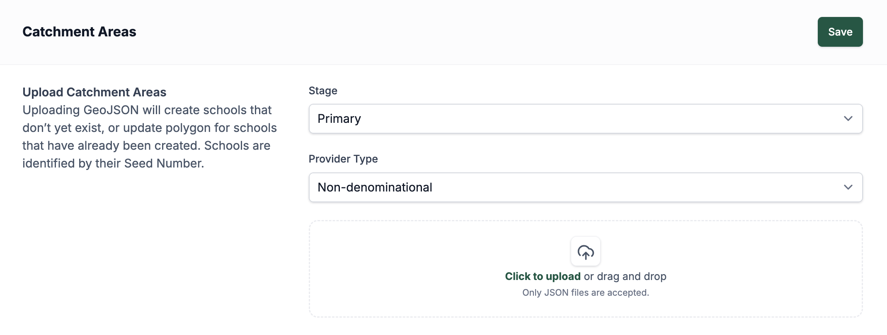
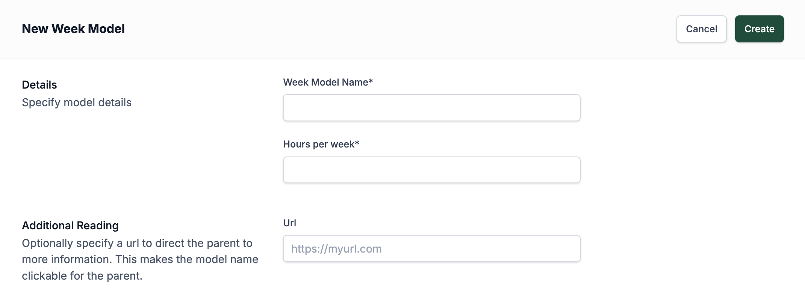
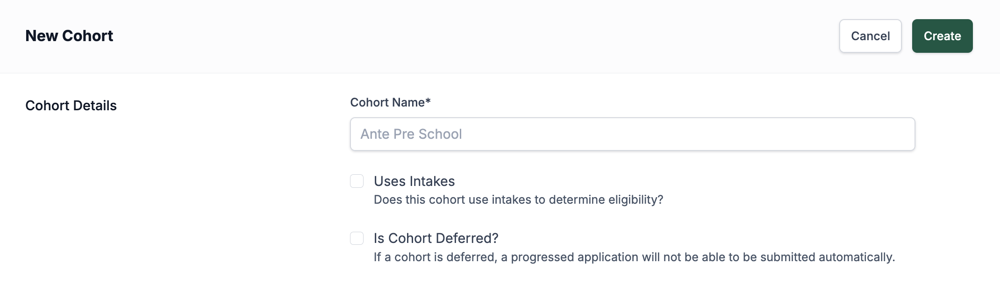
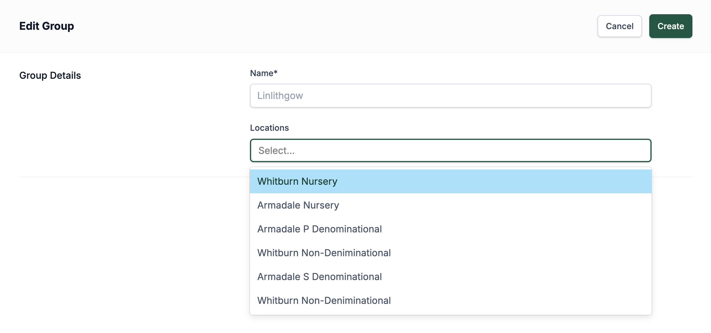
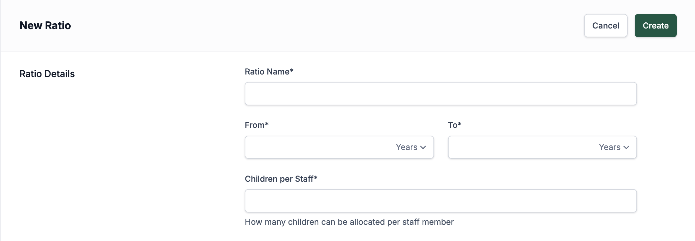

# Structural Elements

The Structural Elements section covers the key building blocks that define how your system is organised. Each element — from catchment areas to week models, cohorts, location groupings, and ratios — plays an important role in how your locations and services are structured and managed. Below, you’ll learn how to create, edit, and manage these elements, ensuring that your platform reflects the real-world structure of your organisation.

### Catchment area

The Catchment areas page gives you the ability to set what areas the Primary and Secondary schools are available to. When you first open the page, you get an option to set Primary or Secondary catchment areas and then be able to set the type of schools you are looking at (Denominational or Non-Denominational). Once you have set these, you can upload a document to set these catchment areas for your selected school types.

### Week Model

Week Models are where you set how many hours per week a child attends the nursery, and these attach to the sessions that get created. When you first view the page, you see all the models that have already been created and how many hours each model is set to have. To create a new model, you just need to press **Add Model** at the top of the screen, and it takes you to a new screen to create one. Once you are on this screen, you will see two input fields at the top: the first is the Title of the model, and the second is how many hours per week the child will be attending the nursery. There is an optional field where you can upload a URL to additional reading that parents might be interested in before choosing this week model, but it is not a mandatory field. After creating the model, it will show in the list of week models, and to edit or delete any of these models, you just need to press the pencil icon to go into the edit view.

:::danger[Deleting Models]
You can not delete a model if there are locations using this model.
:::

### Cohorts

Cohorts are groups of children at various stages of education, from a 2-year-old at nursery all the way to Secondary School. When you first view the page, you can see the list of all the different stages already in the system. To create a new one, press the **Add Cohort** button at the top of the screen, and it takes you to a page to create a new cohort that only has a name field and a checkbox option. The checkbox option works with school years and means that children who fit into this cohort can join not just at the start of the school year but during different intakes of the school year. If this cohort will join the school only at the start of the school year, you don't need to check this checkbox (link to school year knowledge page). Once you have added a name and chosen if you want to use intake or not, you can press **Create**, and it will show up in the list of all the cohorts. To delete or edit any of the cohorts, you just need to press the pencil button on the list view, and it will take you to a page to edit the cohorts. 

:::danger[Deleting Cohorts]
You can not delete a cohort if there are school years using this cohort.
:::

### Location Groupings (Areas)

Location Grouping is a way to group different nurseries together that are either all in a similar area and/or run by similar people, so you want to group these locations together. When viewing a location's edit details page (link knowledge base), you can set the groups there, and you have the option to add none or as many as you want — nurseries can be part of multiple locations if desired. To create a grouping, press the **Add Area** button, and you are taken to a page to create a group. This page consists of a name input and a dropdown with all the locations currently on the system. All you need to create the grouping is to add a title; you can add the locations later or add the grouping to the location itself when you are creating the locations. (link knowledge base) Once it's created, it will show up in the list of groupings with its name and some of the locations that are set to this grouping. To edit or delete the grouping, you can press the pencil icon in the list view, and it takes you to a page to edit the grouping.

### Ratios

Ratios are where we set the ratio of children of a certain age to staff members required to look after them. When you first view the Ratios page, it shows a list of all the current ratios on the platform. To create a new ratio, press the **Add Ratio** button, and it takes you to a new page to create the ratio. First, you are able to give the ratio a name and set the age range of the children that relate to this ratio. When setting the age range, you are able to set the age between months and years. The last thing you are able to do is set how many children can be looked after by a single staff member. After everything has been added, you are able to press **Create**, and now it will be visible in the list of all the ratios.

:::danger[Ratios]
Updating or deleting a ratio will affect all Locations, Resources and Sessions that use this ratio.
:::