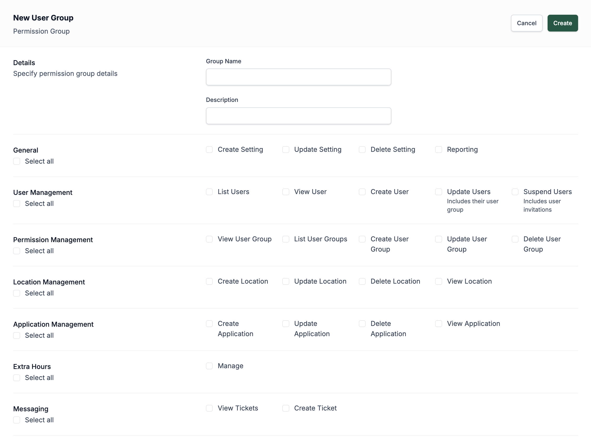
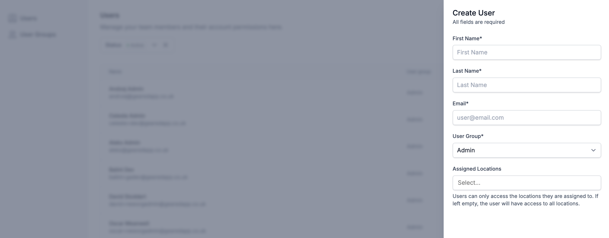

# Staff Dashboard Authentication

All staff users on the Admit platform must authenticate using **email and password** credentials combined with **two-factor authentication (2FA)**.

## Password Requirements
Passwords must meet the following security standards:
- Minimum of **12 characters**
- At least **1 number**
- At least **1 special character**
- At least **1 uppercase letter**
- At least **1 lowercase letter**

## Two-Factor Authentication (2FA)
After setting their password, users must set up **one** of the following 2FA options:
- **SMS Authentication**: A one-time passcode is sent via SMS.
- **Authenticator App**: Use an authenticator app (e.g., Google Authenticator) to generate time-based codes.

---

# User Management

## Overview
Staff users **cannot self-register** on the platform. All accounts must be **created via invitation** by an administrator.  
Before sending an invitation, you must create a **user group** that specifies the access rights and permissions suitable for the staff member’s responsibilities. To create or edit a user group, go to the **Platform Users** section in the sidebar and click on **User Groups**.

## User Groups

### Creating a User Group
- Create a user group **before** inviting a user.
- User groups define the access levels and functionality available to users assigned to them.

### Managing Permissions
- Permissions are **granular** and can be **customised** to meet specific role requirements.
- Permissions can be updated at any time if responsibilities change.
- Staff can be limited to access **only a single location** when required.

## Inviting Users
- Users are invited via an automated email.
- During invitation:
  - Assign the user to an existing **user group**.
  - Restrict location access if necessary.
  - Only add permissions that are necessary to perform normal duties.

## Managing Users

### Editing User Information
- Admins can **edit** user details such as name, email, and group assignments after the account has been created.

### Suspending Users
- Users can be **suspended** to immediately revoke their platform access.
- Suspension is reversible; accounts are not deleted permanently.

### Deleting Users

Deleting a user will immediately revoke their access to the platform. This action is **permanent and cannot be undone**.

Some user-related information may be retained on the platform for **auditing and accountability purposes**, such as records of actions or decisions made while the user had access.
