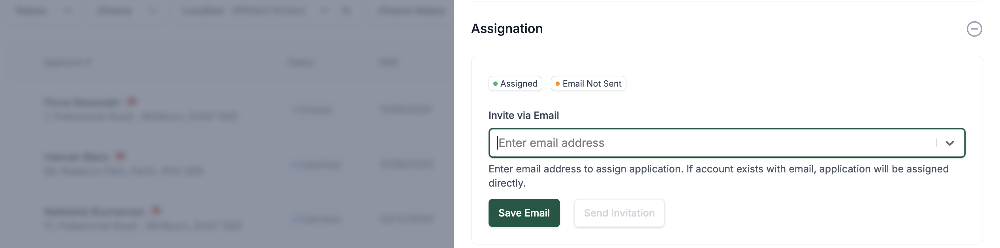

# Parents/Carers Authentication

Parents and carers can access the Admit Platform by creating their own account or being invited by staff if an application already exists.

## Account Creation
Parents/carers have the ability to **create their own account** on the platform.  
During the sign-up process, they can choose between:

- **Using a mygovscot myaccount** (via government authentication)
- **Creating a new account** with:
  - **Username**
  - **Password**
  - **Two-Factor Authentication (2FA)**

## Authentication Options

### Password Requirements
If creating a new username and password, the password must meet the following security standards:
- Minimum of **12 characters**
- At least **1 number**
- At least **1 special character**
- At least **1 uppercase letter**
- At least **1 lowercase letter**

### Two-Factor Authentication (2FA)
Parents/carers setting up a new account must also configure one of the following 2FA methods:
- **SMS Authentication**: A code is sent to the user’s mobile phone.
- **Authenticator App**: Users can scan a QR code or enter a key into an authenticator app (e.g. Google Authenticator) to generate security codes.

---

## Managing Parent Access

### Overview
In some cases, an application for a child may have already been **processed** before the parent/carer has created an account.  
In these cases, **staff users** can invite parents/carers to the platform to **take over the management** of their child’s application.

### Inviting Parents via Assignation
The platform provides an **Assignation** functionality that allows staff to manually assign an application to a parent or carer.

- **Where to Find It:**  
  - Open the child’s application.
  - In the **Quick View Menu**, locate the **Assignation** section.
  
- **Process:**
  1. Enter the parent/carer's **email address**. This field will come prefilled with the parent/carer's email used during submission.  
     - To use an alternative email: reset it by pressing 'X' and enter a new email. Once the new email is entered, confirm by clicking **Create** to add it to the application.
  2. Send an **invitation**.
  3. Once accepted, the parent/carer will have **ownership and management** rights over the application.

This allows for a smooth transition where previously created applications can be securely linked to a parent or carer account.
