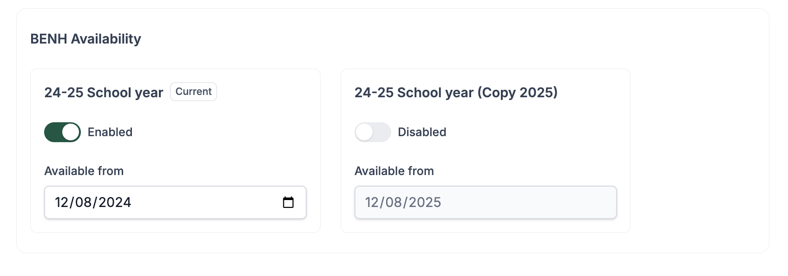
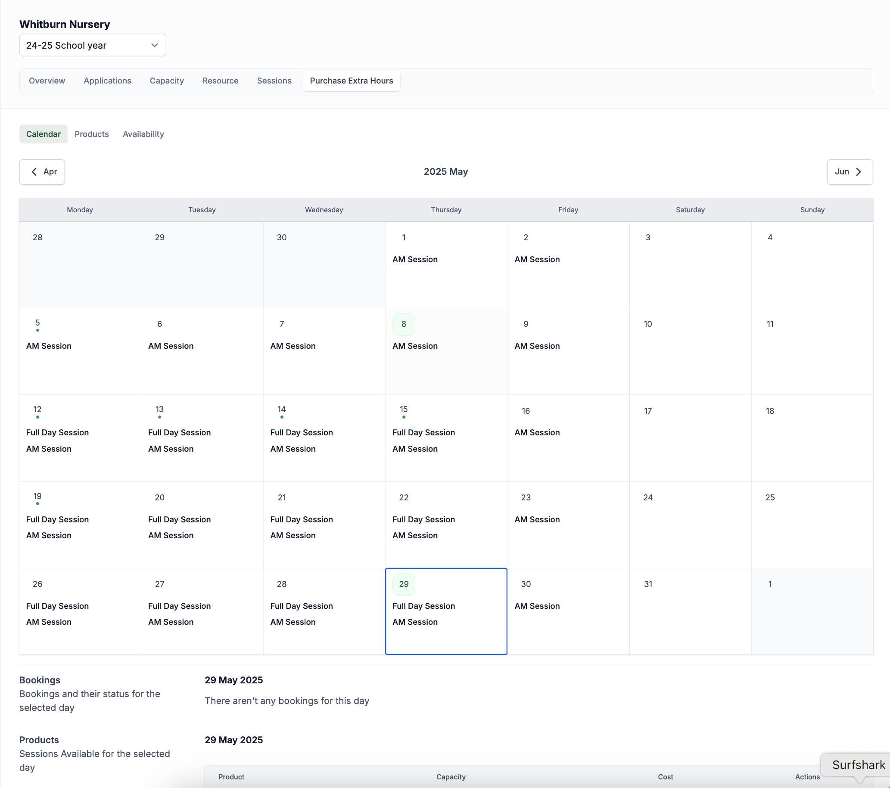
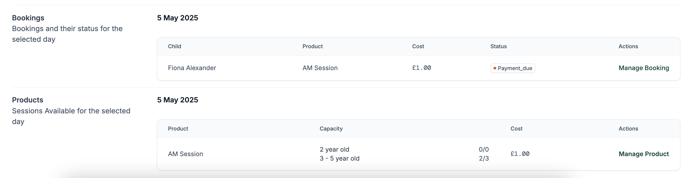
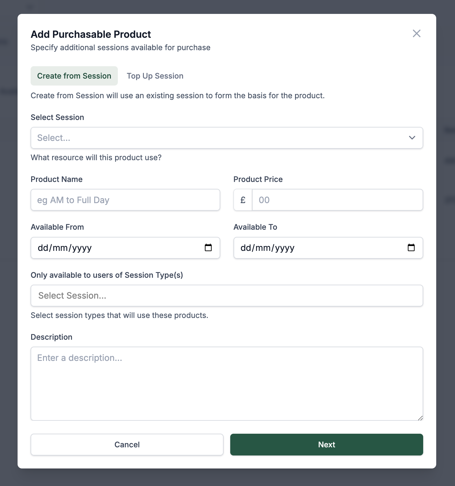
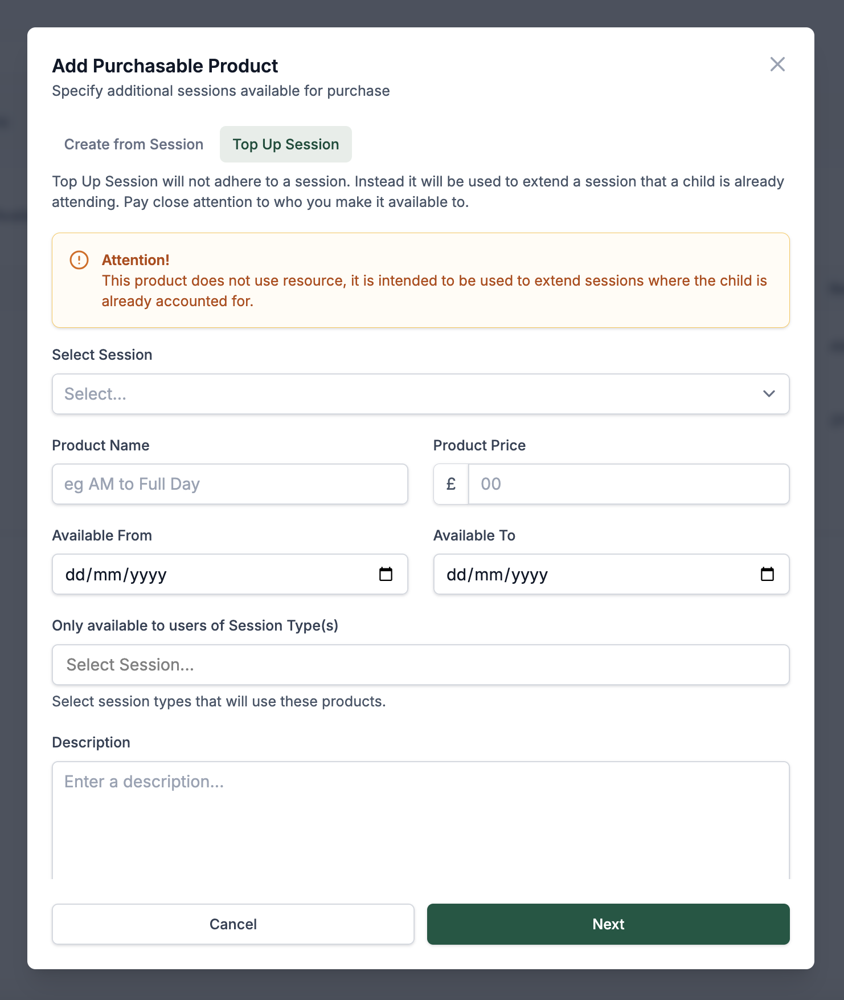
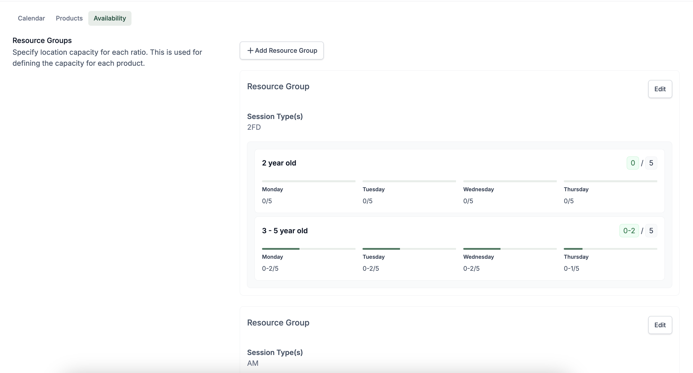

# Buying Extra Nursery Hours (BENH)

Buying Extra Nursery Hours (BENH) is a feature available at the **location level** and is **only enabled for council-run Early Learning and Childcare (ELC) locations**. It allows administrators to manage and offer additional nursery hours to parents and carers.

## Key Concepts

- **BENH** – *Buy Extra Nursery Hours*, the overarching feature that allows the purchase of additional childcare sessions.
- **Products** – Individual purchasable sessions (e.g., AM, PM, Full Day).
- **Session Types** – Types of attendance (e.g., AM, PM, FD).
- **Resources** – Used to manage capacity for additional sessions independently from regular attendance.

---

## Enabling BENH

You can enable or disable BENH for a specific **school year** via the **ELC location settings**.

- Toggle BENH availability per school year.
- Set a **start date** for when BENH products become available to parents, giving you full control over rollout timing.

---

## Managing Extra Hours at a Location

Navigate to:

This area provides three main tabs: **Calendar**, **Products**, and **Availability**.

---

### 1. Calendar View

- Displays all **available and booked products** by date.
- Click a date to view:
  - Products available for that day.
  - Existing bookings (including payment status).
  - Capacity per session type and age group.

---

### 2. Products Tab

Create and manage purchasable extra sessions.

#### Create from Session

- Use an existing session as the base.
- Set:
  - **Session**
  - **Product name**
  - **Price**
  - **Available date range**
  - **Eligible session types**

Useful when you want to offer an extra session to specific groups (e.g., exclude AM for children already attending AM).

Once a product is created, you can **schedule price changes** to take effect during the year (e.g., mid-year rate increases).

#### Create Top-Up Session

- Extends a child’s existing session without assigning additional resources.
- Commonly used for converting short sessions (SS) into full AM or PM sessions.

---

### 3. Availability Tab

BENH capacity is independent of session attendance, providing flexibility in managing additional hours.

- Set the **resource-based capacity** for products.
- Defined by **session type** and **age group** (e.g., 2-year-olds, 3–5-year-olds).
- Ensures product availability aligns with staffing and space.

---

## Booking Behaviour & Discounts

- Products can be booked directly by parents/carers.
- Statuses include **paid** and **unpaid**, both of which are visible in the calendar view.

**Automatic FD Discount**:  
When AM and PM sessions are selected on the same day, the system automatically converts them into a **Full Day (FD)** session and applies the lower FD price if it's more economical for the parent/carer.
