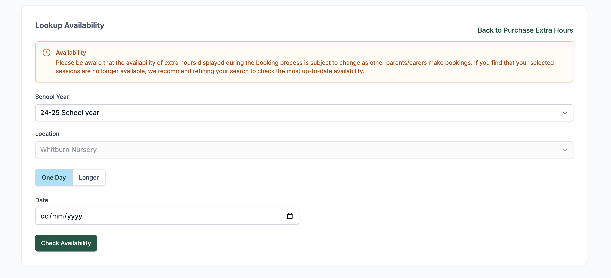
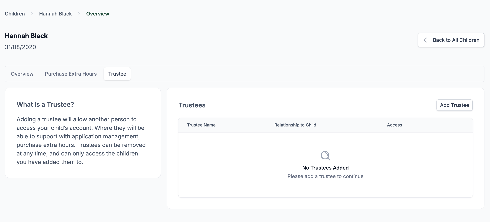
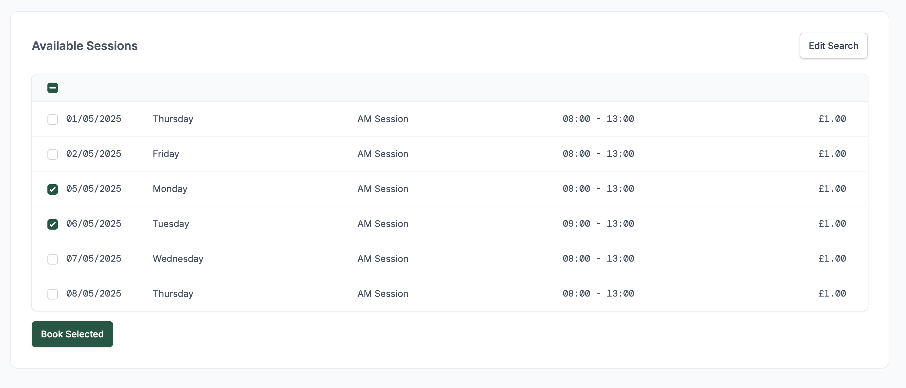
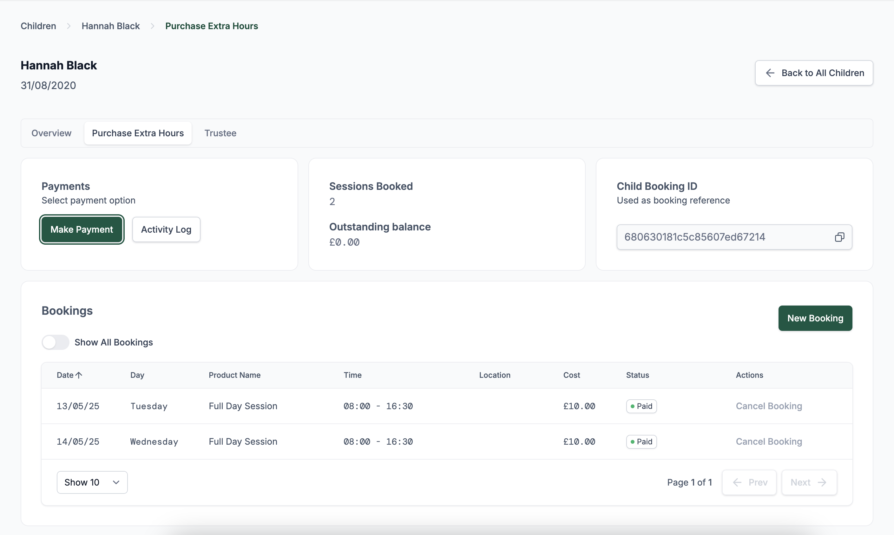

# Booking Extra Sessions

**Buy Extra Nursery Hours (BENH)**

If the Buy Extra Nursery Hours (BENH) products are already created, parents and carers can book additional sessions for children **who have already been granted a place**.

## Availability

- Availability of extra sessions is managed by the **local authority** and can differ by location.
- During booking, a warning may display noting availability may change as others make bookings.
- To view availability:
  - Select the **School Year**.
  - Choose the **Location**.
  - Pick **One Day** or **Longer**.
  - Click **Check Availability**.

## Using a Trustee

Parents and carers can nominate a **Trustee** to make bookings on their behalf.

1. Navigate to the **Trustee** tab under the child's profile.
2. Click **Add Trustee**.
3. Enter the Trustee’s relationship and enable BENH access.
4. Trustees receive an email invite and can only access children they are linked to.

> 💡 **Note**: Local authority staff can also act as Trustees to book hours for families.

## Booking a Session

1. Go to the **Purchase Extra Hours** tab.
2. Click **New Booking**.
3. Set your date range and click **Check Availability**.
4. Tick the checkboxes next to the available sessions.
5. Click **Book Selected**.

A confirmation box will appear:

- You **must agree to the Terms & Conditions** before proceeding.
- After confirmation, a success message will appear.
- A copy of the booking is also sent to the **nursery**.

## Managing Bookings

Your current bookings are listed in the **Bookings** section.

- Use the **Cancel Booking** link next to each item to manage sessions.
- Toggle **Show All Bookings** to include past sessions.

## Payments and Cancellations

- Click **Make Payment** to pay for upcoming sessions.
- The summary tiles show **Sessions Booked** and **Outstanding Balance**.
- Payments must be made **1 week prior** to each session.
- Sessions may be cancelled **up to 4 weeks in advance**.
- When booking multiple sessions, payments are applied to the **earliest unpaid sessions** first.

### Accepted Payment Methods

There are several ways to pay for your booked sessions:

#### ePay (Capita)

- Select **Make Payment** and you’ll be redirected to the **Capita ePay** service.
- This is an external payment gateway.
> ⚠️ **Please note:** It can take up to **24 hours** for the transaction to appear in your account.

#### Tax-Free Childcare

- You can also pay using **Tax-Free Childcare**.
- Please provide your **Tax-Free Childcare reference number** when making a payment.
- This allows staff to match the payment with your account.
> ⚠️ These payments are **manually verified** and may take a **few days** to reflect on your account balance.

#### Childcare Vouchers

- Childcare vouchers are accepted as a valid payment method.
- Please ensure you provide the **name of the voucher scheme(s)** you are using.
> ⚠️ Like Tax-Free Childcare, these payments are **manually checked**, so it may take **several days** for the balance to update.

## Activity Log

All actions taken on the account — such as bookings, cancellations, payments, etc. — are recorded in the **Activity Log**.

- This can be accessed via the **Activity Log** button on the main booking screen.
- Both **parents/carers and staff** can view this log to see a complete history of actions related to bookings.
