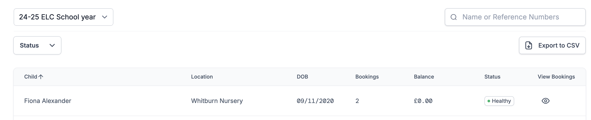
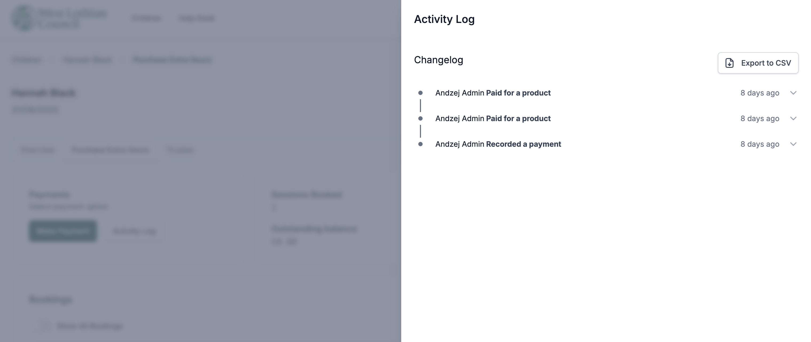
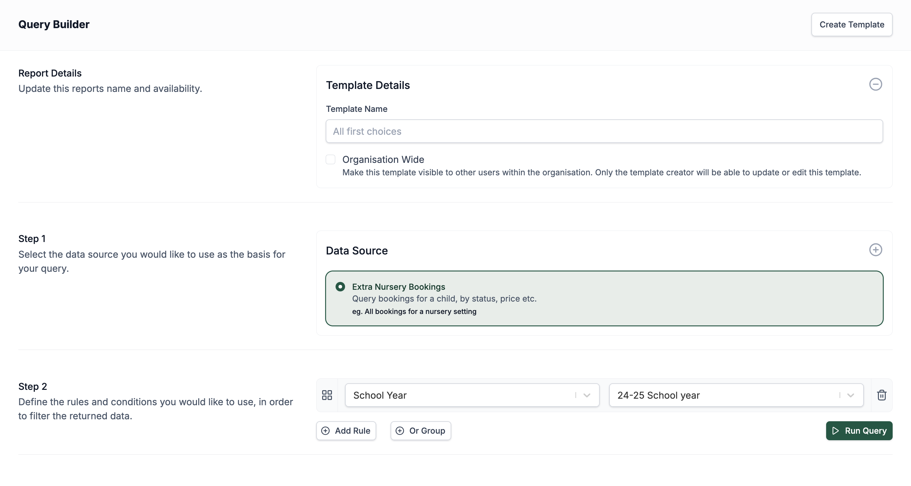

# BENH Reports

**Buy Extra Nursery Hours (BENH)**

# Reports in Admit

The **Reports** feature in the Admit platform gives administrators a powerful set of tools to monitor, manage and analyse extra nursery bookings and payments.

## Overview of Extra Hours Bookings

You can access an overview of all bookings by navigating to the **Extra Hours Bookings** section in the main sidebar. This section provides:

- A list of all children who have had any bookings within the selected school year.
- A visual indication of the payment ‘health’ for each child’s account — making it easy to spot unpaid or overdue balances.

Clicking on a child will open a **detailed view** of their booking record.

## Booking Detail View

Within the detailed view for each child, you have access to a range of administrative controls:

- **Enable or disable bookings** – Useful when families fall behind on payments and you need to restrict access.
- **Enable or disable payment methods** – Choose which payment methods are available for that specific account.
- **Cancel existing bookings** – Remove scheduled bookings if needed.
- **View activity log** – See a complete history of all actions related to the account.
- **Record a payment** – Manually log transactions and make financial adjustments.

### Recording Payments

The **Record Payment** feature provides several important options:

- **Log a payment**:  
  - *ePay Capita* transactions will appear automatically.  
  - *Tax-Free Childcare* and *Childcare Voucher* payments must be entered manually.  
  - If automation fails for ePay Capita, you can also record those manually.
  
- **Create a refund**:  
  - This action serves as a log only — it does not trigger the actual transfer of funds.
  - It records that funds were returned to the original payer.

- **Add a credit to an account**:  
  - This also serves as a log and does not involve any physical transfer of funds.
  - Credits are typically used to offset future bookings or charges.

### Activity Log

All actions taken on the account — such as bookings, cancellations, payments, and changes to account settings — are recorded in the **Activity Log**.

- Access this by clicking the **Activity Log** button on the child’s booking screen.
- Both **parents/carers and staff** can view the full booking history from this section.

## Using the Query Builder for Detailed Reports

To run more advanced reports and extract specific booking information, you can use the **Query Builder**:

1. Go to the **Reports** section from the main sidebar.
2. Click **Launch Query Builder** in the top navigation.
3. Choose **Extra Nursery Bookings** as your data source.
4. Customise your report by applying filters and selecting the relevant data fields.

You can also **export** the data for offline analysis or record-keeping. If you want to revisit the same report in the future:
- Add a name in Report Details section and click **Create Template**.
- By selecting Organisation Wide checkbox, you can make this template visible to other users within the organisation. Only the template creator will be able to update or edit this template.

